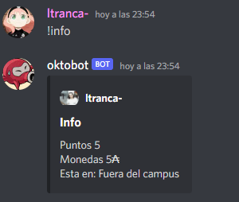
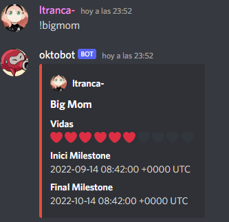

# Oktobot
El bot de discord de 42 barcelona!
## Comandos 
**!info login**: Da la informacion del login que hayais puesto como parametro, si no hay parametro da la informacion de tu login, la informacion es:
- Puntos de evaluacion
- Monedas
- Localizacion en el campus

**!bigmom login**: Da la informacion relacionada a bigmom del login en el parametro, como en info si no hay parametro da la informacion de tu login, la informacion es:
- Corazones
- Inicio de tu milestone actual
- Final de tu milestone actual

**!days login**: Da los dias restantes para tu proximo checkpoint (1 de cada mes) y de tu proxima milestone (depende en que parte del common core estas)

**!ping**: Da tu ping actual

**!ask_staff**: Te da la repuesta que necesitas del Staff

## Agradecimientos
- A 42 barcelona por darnos esta oportunidad
- A hive helsinki por hacer la libreria de python
- A ltranca-, blvilarn, marijime y mferri-m por colaborar en la creacion del bot
- A todos vosotros por ser tan geniales <3
